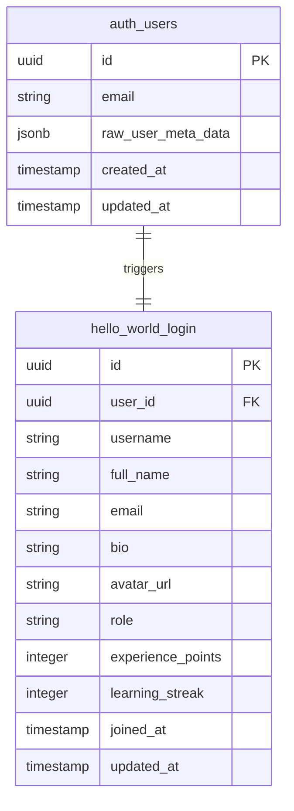
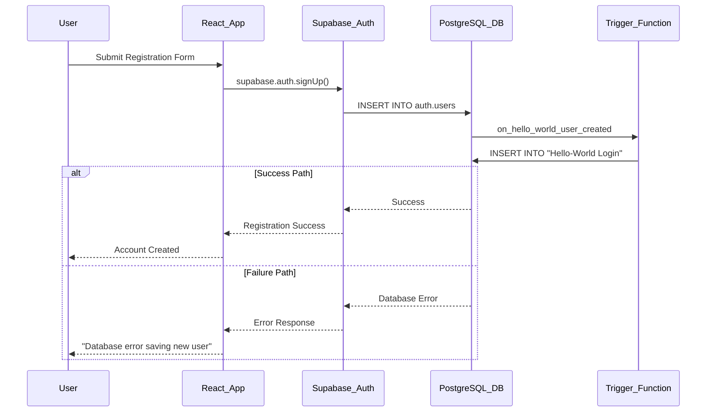

# Supabase User Registration Database Error Fix

## Overview

The HelloWorld learning platform is experiencing a "Database error saving new user" issue during user registration. This error occurs when new users attempt to create accounts through the authentication system, preventing them from accessing the gamified learning platform.

## Problem Analysis

### Current Architecture
- **Frontend**: React 18.3.1 with TypeScript
- **Authentication**: Supabase Auth with custom user profile system
- **Database**: PostgreSQL via Supabase with Row Level Security (RLS)
- **User Management**: Custom profile table "Hello-World Login"

### Root Cause Investigation

The registration error stems from several potential issues in the Supabase integration:

1. **Database Trigger Failure**: The automatic profile creation trigger may be failing
2. **RLS Policy Conflicts**: Row Level Security policies may be blocking profile insertion
3. **Metadata Handling**: User metadata mapping issues in the trigger function
4. **Connection Configuration**: Incorrect Supabase client configuration

## Technical Architecture

### Database Schema Structure



### Authentication Flow Architecture



## Issue Resolution Strategy

### 1. Database Configuration Verification

| Component | Current Value | Verification Required |
|-----------|---------------|----------------------|
| Supabase URL | https://oxwgmgngnsjfmeuiaorn.supabase.co | ✓ Matches provided credentials |
| Anon Key | eyJhbGciOiJIUzI1NiIsInR5cCI6IkpXVCJ9... | ✓ Matches provided credentials |
| Table Name | "Hello-World Login" | ✓ Requires quotes due to spaces |
| RLS Status | Enabled | ✓ Requires policy review |

### 2. Row Level Security Policy Analysis

Current policies may be preventing automatic profile creation:

```sql
-- Policy that might cause issues
CREATE POLICY "Users can create their own profile"
ON public."Hello-World Login"
FOR INSERT 
WITH CHECK (auth.uid() = user_id);
```

**Issue**: During trigger execution, `auth.uid()` may not be properly set, causing INSERT failures.

### 3. Trigger Function Enhancement

The current trigger function needs enhancement for better error handling:

```sql
CREATE OR REPLACE FUNCTION public.handle_hello_world_user()
RETURNS TRIGGER 
LANGUAGE plpgsql 
SECURITY DEFINER 
SET search_path = public
AS $$
BEGIN
  INSERT INTO public."Hello-World Login" (
    user_id,
    username,
    full_name,
    email
  ) VALUES (
    NEW.id,
    NEW.raw_user_meta_data ->> 'username',
    NEW.raw_user_meta_data ->> 'full_name',
    NEW.email
  );
  RETURN NEW;
EXCEPTION
  WHEN OTHERS THEN
    -- Log error and continue
    RAISE LOG 'Profile creation failed for user %: %', NEW.id, SQLERRM;
    RETURN NEW;
END;
$$;
```

## Implementation Plan

### Phase 1: Database Policy Adjustment

1. **Modify RLS Policies**: Update INSERT policy to allow trigger-based insertions
2. **Add Service Role Policy**: Create policy for service role operations
3. **Test Trigger Function**: Verify trigger execution with proper permissions

### Phase 2: Client Configuration Enhancement

1. **Environment Variable Setup**: Move credentials to environment variables
2. **Error Handling Improvement**: Add comprehensive error logging
3. **Retry Mechanism**: Implement registration retry logic

### Phase 3: User Experience Optimization

1. **Loading States**: Enhance registration loading indicators
2. **Error Messages**: Provide specific error feedback to users
3. **Fallback Handling**: Manual profile creation fallback

## Database Migration Strategy

### Step 1: Policy Modification

```sql
-- Drop existing restrictive policy
DROP POLICY IF EXISTS "Users can create their own profile" ON public."Hello-World Login";

-- Create new policy allowing service role insertions
CREATE POLICY "Allow profile creation"
ON public."Hello-World Login"
FOR INSERT 
WITH CHECK (
  auth.uid() = user_id OR 
  auth.role() = 'service_role' OR
  current_setting('request.jwt.claims', true)::json->>'role' = 'service_role'
);
```

### Step 2: Trigger Function Enhancement

```sql
CREATE OR REPLACE FUNCTION public.handle_hello_world_user()
RETURNS TRIGGER 
LANGUAGE plpgsql 
SECURITY DEFINER 
SET search_path = public
AS $$
DECLARE
  profile_exists boolean;
BEGIN
  -- Check if profile already exists
  SELECT EXISTS(
    SELECT 1 FROM public."Hello-World Login" WHERE user_id = NEW.id
  ) INTO profile_exists;
  
  -- Only create profile if it doesn't exist
  IF NOT profile_exists THEN
    INSERT INTO public."Hello-World Login" (
      user_id,
      username,
      full_name,
      email,
      joined_at
    ) VALUES (
      NEW.id,
      COALESCE(NEW.raw_user_meta_data ->> 'username', split_part(NEW.email, '@', 1)),
      COALESCE(NEW.raw_user_meta_data ->> 'full_name', 'New User'),
      NEW.email,
      NOW()
    );
  END IF;
  
  RETURN NEW;
EXCEPTION
  WHEN OTHERS THEN
    RAISE LOG 'Profile creation failed for user %: %', NEW.id, SQLERRM;
    RETURN NEW;
END;
$$;
```

## Frontend Implementation Updates

### Enhanced Error Handling

```typescript
const handleSignUp = async (e: React.FormEvent) => {
  e.preventDefault();
  setLoading(true);
  setError('');

  try {
    const { data, error } = await supabase.auth.signUp({
      email,
      password,
      options: {
        emailRedirectTo: `${window.location.origin}/`,
        data: {
          full_name: fullName,
          username: email.split('@')[0], // Generate username from email
        }
      }
    });

    if (error) {
      // Enhanced error handling
      if (error.message.includes('Database error')) {
        throw new Error('Registration temporarily unavailable. Please try again.');
      }
      throw error;
    }

    // Verify profile creation
    if (data.user) {
      // Wait for profile creation
      await new Promise(resolve => setTimeout(resolve, 1000));
      
      const { data: profile } = await supabase
        .from('Hello-World Login')
        .select('*')
        .eq('user_id', data.user.id)
        .single();
        
      if (!profile) {
        // Fallback: Manual profile creation
        await createUserProfile(data.user);
      }
    }

    toast({
      title: "Account created successfully!",
      description: "Please check your email to verify your account.",
    });
  } catch (error: any) {
    setError(error.message);
  } finally {
    setLoading(false);
  }
};
```

### Fallback Profile Creation

```typescript
const createUserProfile = async (user: User) => {
  const { error } = await supabase
    .from('Hello-World Login')
    .insert({
      user_id: user.id,
      email: user.email,
      full_name: user.user_metadata?.full_name || 'New User',
      username: user.email?.split('@')[0] || `user_${user.id.slice(0, 8)}`,
      joined_at: new Date().toISOString(),
    });
    
  if (error) {
    console.error('Manual profile creation failed:', error);
    throw new Error('Account creation incomplete. Please contact support.');
  }
};
```

## Testing Strategy

### Unit Testing Scenarios

| Test Case | Description | Expected Result |
|-----------|-------------|-----------------|
| Valid Registration | User with valid email/password | Profile created successfully |
| Duplicate Email | Registration with existing email | Appropriate error message |
| Invalid Email | Registration with malformed email | Validation error |
| Database Failure | Simulated database connection issue | Graceful error handling |
| Trigger Failure | Profile creation trigger fails | Manual fallback execution |

### Integration Testing

1. **Database Connection**: Verify Supabase connectivity
2. **Authentication Flow**: Test complete registration process
3. **Profile Creation**: Verify automatic profile creation
4. **RLS Policies**: Test policy enforcement
5. **Error Scenarios**: Test various failure modes

## Monitoring and Logging

### Error Tracking Implementation

```typescript
const logRegistrationError = async (error: any, userEmail: string) => {
  console.error('Registration Error:', {
    error: error.message,
    email: userEmail,
    timestamp: new Date().toISOString(),
    userAgent: navigator.userAgent,
  });
  
  // Optional: Send to error tracking service
  // await errorTrackingService.log(error);
};
```

### Database Monitoring Queries

```sql
-- Monitor failed registrations
SELECT 
  COUNT(*) as failed_registrations,
  DATE_TRUNC('hour', created_at) as hour
FROM auth.users 
WHERE id NOT IN (
  SELECT user_id FROM public."Hello-World Login"
)
GROUP BY hour
ORDER BY hour DESC;
```

## Security Considerations

### Data Protection

1. **PII Handling**: Ensure user data is properly encrypted
2. **Access Control**: Maintain strict RLS policies
3. **Audit Trail**: Log all profile creation attempts
4. **Input Validation**: Sanitize all user inputs

### Authentication Security

1. **Password Requirements**: Enforce strong password policies
2. **Email Verification**: Require email confirmation
3. **Rate Limiting**: Prevent registration abuse
4. **Session Management**: Secure session handling

## Expected Outcomes

### Immediate Fixes

1. **Registration Success**: Users can successfully create accounts
2. **Profile Creation**: Automatic profile generation works reliably
3. **Error Handling**: Clear error messages for users
4. **Data Consistency**: No orphaned auth records

### Long-term Improvements

1. **System Reliability**: Reduced registration failures
2. **User Experience**: Smoother onboarding process
3. **Monitoring**: Better visibility into registration issues
4. **Scalability**: Improved handling of concurrent registrations